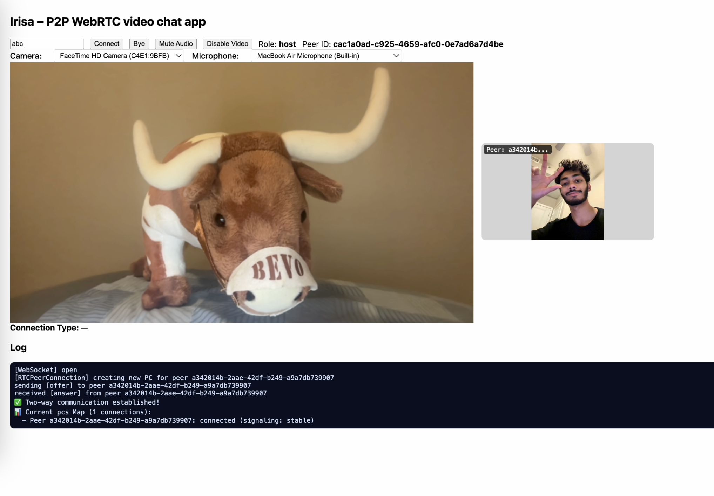

## Irisa – P2P WebRTC video chat app

<p align="center">
  
</p>

A minimal WebRTC video chat app:
  - Rust (Axum/Tokio) WebSocket server for signaling
  - Browser client in `static/index.html`
  - Mesh topology (each peer connects to every other peer)

### What did I learn

I have always wanted to build this. I hacked together a simple prototype, deployed it quickly, and immediately dropped the link in the group chat to test with friends. This project was actually fun as I learned a lot of networking concepts without taking a college course in it. I went deep on WebRTC fundamentals (ICE candidates, offer/answer handshake, TURN vs STUN), browser media APIs (getUserMedia, device switching, track replacement), and WebSocket signaling, room management, and multi‑peer topologies. I saw firsthand how mesh falls apart beyond a few participants and why SFU (star) exist and how different network topologies trade off simplicity, bandwidth, and scalability.

In rebuilding from scratch what already exists, I still learned a lot and grew my appetite to delve deeper.

### Quick start

1. Prereqs: Rust (stable), a modern browser
2. Run the server:

```
cargo run
```

3. Open the client:

```
http://localhost:8080
```

4. Enter a room id (e.g., `abc`) and click Connect on two+ tabs/devices.

### Features (current)

- Rooms with unlimited peers (mesh)
- Automatic role assignment (first peer becomes host)
- Per‑peer `RTCPeerConnection` map (one connection per remote peer)
- Remote video tiles with peer id labels
- Basic device controls (camera/microphone select, mute, video toggle)
- TURN/STUN: dynamic Metered API with static fallbacks

### Known limitations (mesh topology)

- Mesh scales poorly (>3–5 peers) because each client uploads to everyone.
- Uplink and CPU grow with number of participants.

### Features to be added

- SFU migration (LiveKit or groundup)
  - Each client uploads once; SFU fans out to subscribers
  - Adaptive quality, better bandwidth control
  - Optional server‑side recording and datachannels
- Music bot
  - Resolve audio, transcode to Opus, publish one track
  - with SFU: publish once and fan‑out

### Project layout

- `src/main.rs` – Rust signaling server
- `static/index.html` – client UI and WebRTC logic
